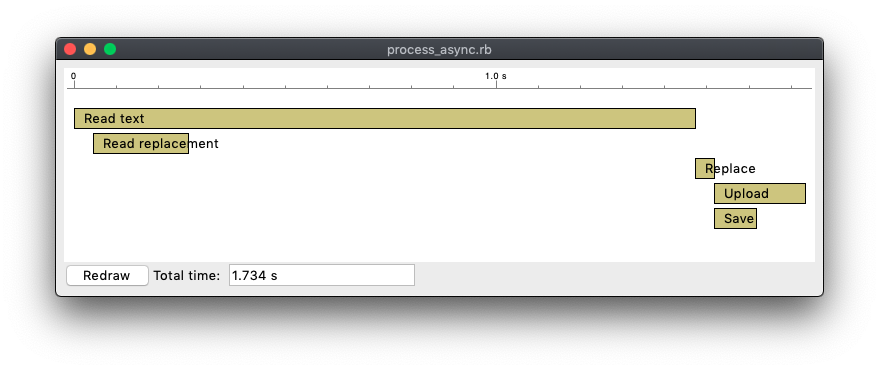

# Examples for Ruby 3 Concurrency

In this repo you have some example code to test the new concurrency
features in Ruby 3: The Fiber Scheduler and Ractors.

There's code to cover 3 characteristic scenarios

- A combination of IO and CPU tasks
- A bunch of CPU intensive tasks
- A sequence of Download-Process-Upload steps, akin to accessing
  a paginated API

You can find a live run through these examples in this presentation:

- [Slides](https://speakerdeck.com/josep_egea/concurrencyinruby3-josepegea)
- [Video](https://vimeo.com/556879297)

## Displaying the results

The examples themselves run the tasks and write timing information to
STDOUT.

In order to make results easier to visualize, there's also a script
that uses [tk_component](https://github.com/josepegea/tk_component) to
diplay graphical bars with the timings for each task (`tk_component`
is a Ruby Gem that provides a component approach to build Ruby/TK
applications).

## Running the code

In order to run any of the tests, use the `run_test.rb` script.

For instance, to run the `process_plain.rb` example, you would run:

``` bash
bundle exec ./run_test.rb process_async.rb
```

That should produce results like these:



In case the script needs some arguments, enclose both the script name
and the arguments in quotes, like here:

``` bash
bundle exec ./run_test.rb "paging_threads.rb 6"
```

## Scenario 1: Download, process and upload data from/to several sources

The script will download a big text (War and Peace) from Project
Guttemberg and some words from an HTTP API.

Once it has both, it will do a global replace of the strings across
the whole text.

When done, it will save the results in a local file and upload part of
it to an HTTP API.

- [process_plain.rb](./process_plain.rb) No concurrency. Every step is
  executed sequentially.
- [process_threads.rb](./process_threads.rb) Uses thread. For every
  task that can be performed in parallel, a new Thread is created.
- [process_async.rb](./process_async.rb) Uses the Fiber Scheduler in
  Ruby 3, thanks to the [async](https://github.com/socketry/async)
  Gem.

### Takeaway for Scenario 1

Both Threads and Fiber Scheduler provide concurrency.

The Threads example provides more concurrency because:

- Local filesystem IO operations are still blocking under the Fiber
  Scheduler.
- DNS lookups are blocking, too.

The Async example could be made more concurrent by inverting the order
of the the items in the last step: uploading and then saving instead
of saving and then uploading, as the uploading will not block while
saving will.

## Scenario 2: String substitution in parallel

The script will download again "War and Peace" (but the time for that
won't be included in the results) and then perform a string
substitution on it for 5 times.

- [cpu_plain.rb](./cpu_plain.rb) No concurrency. Every step is done sequentially.
- [cpu_threads.rb](./cpu_threads.rb). A Thread is created for each of
  the 5 tasks.
- [cpu_async.rb](./cpu_async.rb) A Fiber Scheduler is used to run the
  5 tasks asynchronously.
- [cpu_ractors.rb](./cpu_ractors.rb) A Ractor (new in Ruby 3) is
  created for each of the tasks.

### Takeaway for Scenario 2

As expected, Async doesn't give any concurrency here, given that
there's no IO performed in the code.

Threads appear to be concurrent, but given they're running just Ruby
code, the GIL (Global Interpreter Lock) in Ruby prevents more than one
from being run at the same time, so threads just still the lock from
one another and the total time is the same.

However, Ractors don't suffer from the GIL problem, so they can truly
run concurrently and take advantage of multicore processors.

## Scenario 3: Paging through an API

The script will read entries from a an HTTP API in batches (pages). For
each page, it will do some string processing. When done, it will
upload the results to another HTTP API endpoint.

If you pass an additional argument to the script, it will use it as
the page size. If absent, page size defaults to 2 items per page.

- [paging_plain.rb](./paging_plain.rb) No concurrency. Everything done
  sequentially.
- [paging_threads.rb](./paging_threads.rb) The script uses 3 Threads
  and 2 Queues. The first Thread reads pages from the API and puts the
  results in one Queue. The second Thread gets data from the Queue,
  processes it and puts the results in the second Queue. The third
  Thread reads from the second Queue and uploads the data.
- [paging_async.rb](./paging_async.rb) Similar to the Threads script
  but using the Fiber Scheduler instead.

### Takeaway for Scenario 3

The results are quite similar to Scenario 1. Again, Threads are a
little more concurrent, but just sightly. Fiber Scheduler works
fantastically well and provides very good concurrency without having
to worry about thread safety of the code.

We couldn't run a Ractor based version because there is a problem with
the `URI` class using class variables that makes it break when run
under different Ractors.
